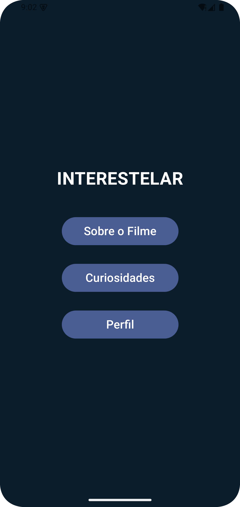

# 🎬 Interstelar App

Aplicativo Android desenvolvido para estudar navegação entre telas, com base no filme **Interestelar**, apresentando informações gerais, curiosidades e perfil do usuário.

---

## 🖼️ Screenshots

### Tela Inicial (menu)

### Sobre o Filme

### Curiosidades

### Perfil

## 🛠️ Tecnologias Utilizadas

- Android Studio  
